# Warning - Acil Durum Uygulaması  (v1.0.1)

[](https://kotlinlang.org/)
[](https://www.android.com/)
[](https://developer.android.com/jetpack/compose)

## Project Overview

**Warning**, acil durumlarda hızlı bir şekilde yakınlarınıza acil durum mesajı göndermenizi sağlayan bir Android uygulamasıdır. Uygulama, kullanıcıların acil durum butonuna basarak konum bilgileriyle birlikte önceden tanımladıkları kişilere otomatik olarak mesaj göndermesine olanak tanır.

<p align="center">
  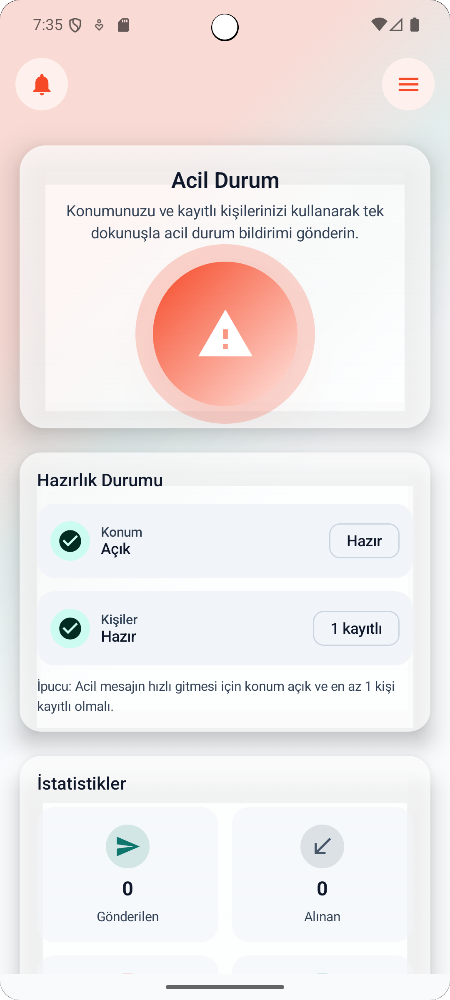
  
  
  <br>
  <em>Ana Ekran, Hazırlık Durumu Görünümü</em>
</p>

Uygulama, Firebase Authentication ile telefon numarası tabanlı kimlik doğrulama kullanır. Kullanıcılar kayıt olduktan sonra acil durum mesajı gönderebilecekleri kişileri (contact) ekleyebilir, bu kişilerle bağlantı kurarak (linked) karşılıklı acil durum bildirimleri alabilirler. Uygulama, gerçek zamanlı veri senkronizasyonu için Firebase Firestore kullanır ve offline çalışma desteği için Room veritabanı ile yerel veri saklama sağlar.

**Hedef Kullanıcı Kitlesi**: Acil durumlarda hızlı yardım çağrısı yapmak isteyen tüm kullanıcılar. Özellikle yalnız yaşayanlar, yaşlılar, kronik hastalığı olanlar veya riskli işlerde çalışanlar için tasarlanmıştır.

**Temel Senaryolar**:
- Kullanıcı kaydı ve telefon numarası ile giriş yapma
- Acil durum mesajı gönderme (konum bilgisi ile)
- Kişi ekleme ve yönetme
- Bağlantı (linked) istekleri gönderme/alma
- Profil düzenleme ve ayarlar
- Push bildirimleri alma

## Features

- **Kullanıcı Kimlik Doğrulama**
    - Firebase Authentication ile telefon numarası tabanlı giriş
    - SMS doğrulama kodu ile güvenli kayıt/giriş
    - Otomatik oturum yönetimi

<p align="center">
  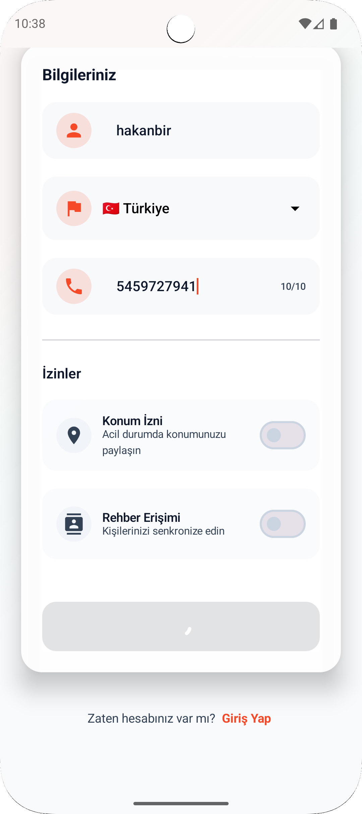
  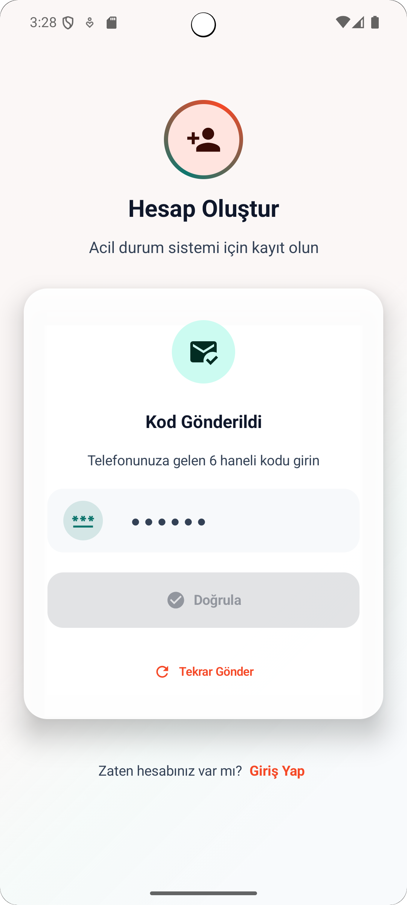
  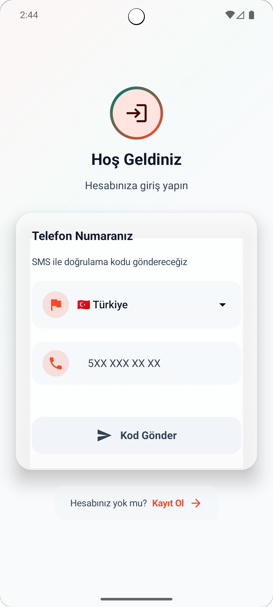
  <br>
  <em> giriş / kayıt ve doğrulama ekranları e</em>
</p>

- **Acil Durum Mesajı Gönderme**
    - Tek dokunuşla acil durum mesajı gönderme
    - Otomatik konum bilgisi ekleme
    - Tüm kayıtlı kişilere toplu mesaj gönderme
    - Gönderim durumu takibi (başarılı/başarısız sayıları)

<p align="center">
  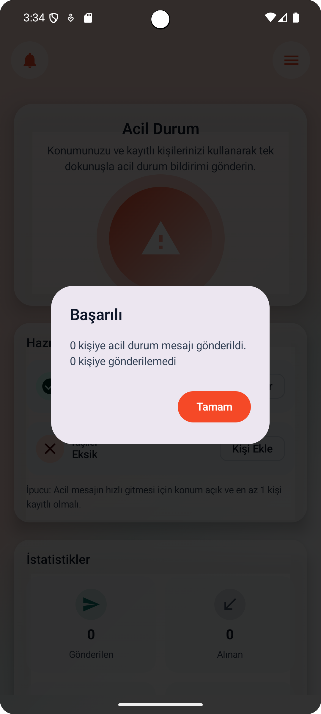
  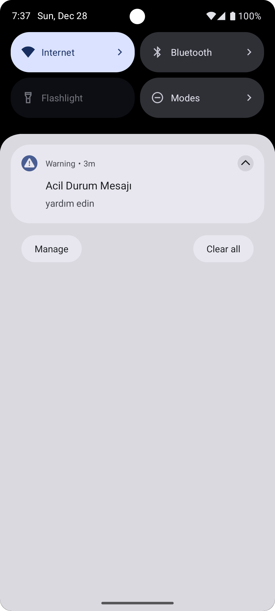  
  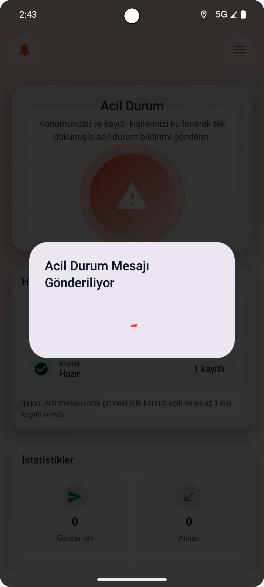
  <br>
  <em> Tek tuşla acil durum mesajı</em>
</p>

- **Kişi Yönetimi**
    - Kişi ekleme, düzenleme ve silme
    - Kişiler için özel mesaj tanımlama
    - Kişileri üste sabitleme (isTop)
    - Kişi etiketleme (tag) sistemi
    - Konum paylaşımı tercihi yönetimi

<p align="center">
  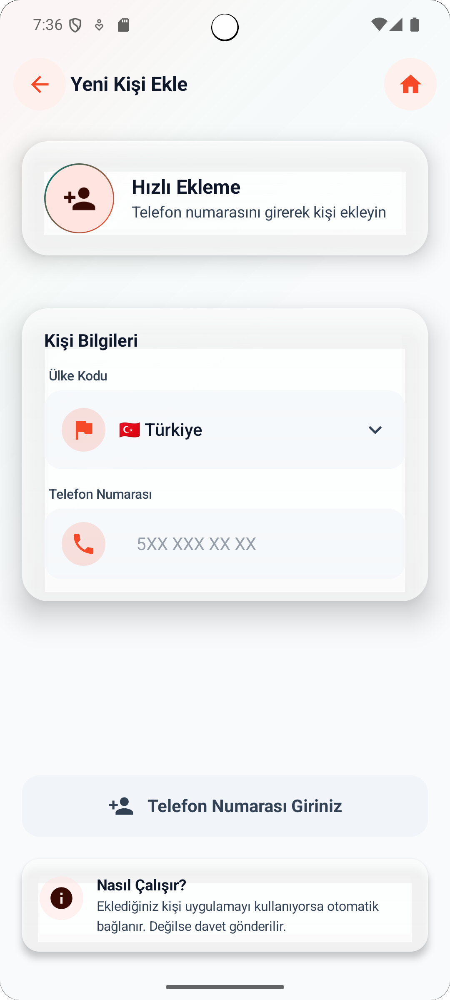
  <br>
  <em>bağlantı ekleme</em>
</p>

- **Bağlantı (Linked) Sistemi**
    - Karşılıklı bağlantı kurma
    - Bağlantı istekleri gönderme/alma
    - Bağlantı onaylama/reddetme

<p align="center">
  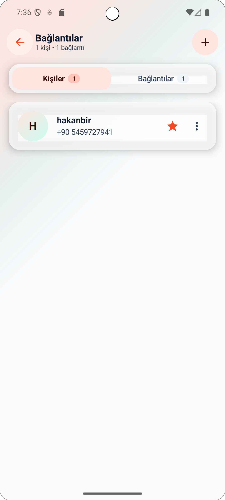
  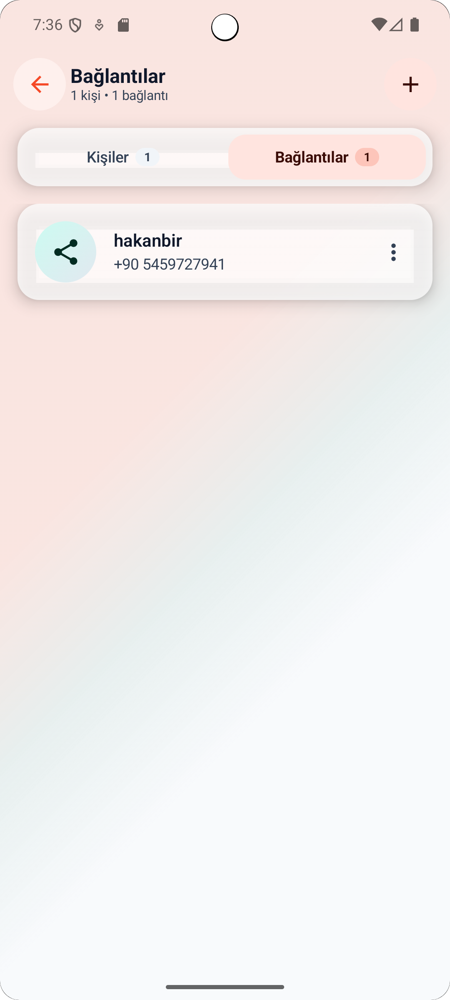
  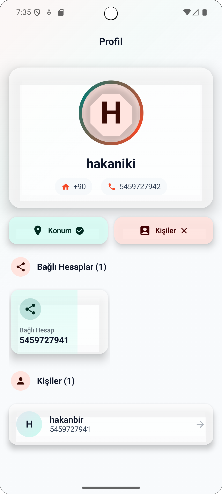
  <br>
  <em>Kişiler Listesi, Aktif Bağlantılar ve Kullanıcı Profili</em>
</p>

- **Gerçek Zamanlı Senkronizasyon**
    - Firebase Firestore ile gerçek zamanlı veri senkronizasyonu
    - Profil, kişi ve bağlantı verilerinin anlık güncellenmesi
    - Offline destek ile yerel veri saklama (Room)

- **Push Bildirimleri**
    - Firebase Cloud Messaging (FCM) entegrasyonu
    - Acil durum bildirimleri alma
    - Bildirim izinleri yönetimi

<p align="center">
  
  
  
  <br>
  <em> karşı kullanıcıya iletilen bildirim </em>
</p>

- **Konum Servisleri**
    - Konum izinleri yönetimi
    - GPS durumu kontrolü
    - Acil durum mesajlarında otomatik konum ekleme

- **Profil Yönetimi**
    - Profil fotoğrafı yükleme/güncelleme
    - İsim ve acil durum mesajı düzenleme
    - Konum izni tercihleri

<p align="center">
  
  <br>
  <em> profil ekranı </em>
</p>

- **Ayarlar**
    - Uygulama ayarları yönetimi
    - Bildirim tercihleri

## Tech Stack

### Dil
- **Kotlin** (2.0.21) - Modern Android geliştirme için tercih edilen dil

### Mimariler
- **Clean Architecture** - Domain, Data, Presentation katmanları ile modüler yapı
- **MVVM (Model-View-ViewModel)** - UI state yönetimi için ViewModel pattern
- **Repository Pattern** - Veri kaynaklarının soyutlanması

### UI Framework
- **Jetpack Compose** (BOM: 2024.05.00) - Modern declarative UI framework
- **Material 3** - Google'ın en yeni tasarım sistemi
- **Navigation Compose** (2.9.0) - Ekranlar arası geçiş yönetimi

### Dependency Injection
- **Hilt** (2.51.1) - Dagger'ın Android için sadeleştirilmiş versiyonu
- **Hilt Navigation Compose** (1.2.0) - Compose ile Hilt entegrasyonu

### Network
- **Retrofit** (2.9.0) - REST API çağrıları için type-safe HTTP client
- **OkHttp** (4.12.0) - HTTP istekleri için güçlü client
- **Gson** (2.10.1) - JSON serialization/deserialization

### Asenkron İşlemler
- **Kotlin Coroutines** - Asenkron programlama
- **Flow** - Reactive stream API
- **suspend functions** - Coroutine tabanlı asenkron işlemler

### Local Storage
- **Room** (2.7.1) - SQLite wrapper, offline veri saklama
- **DataStore Preferences** (1.1.7) - Key-value veri saklama

### Firebase Services
- **Firebase Authentication** - Telefon numarası tabanlı kimlik doğrulama
- **Cloud Firestore** - NoSQL veritabanı, gerçek zamanlı senkronizasyon
- **Cloud Messaging (FCM)** - Push bildirimleri
- **Cloud Functions** - Backend iş mantığı (Node.js)
- **Firebase Analytics** - Kullanım analitiği

### Image Loading
- **Coil** (2.6.0) - Modern image loading library (Compose uyumlu)

### Diğer Kütüphaneler
- **Accompanist SwipeRefresh** (0.36.0) - Pull-to-refresh desteği
- **Lifecycle Runtime KTX** (2.9.0) - Lifecycle-aware bileşenler

## Architecture

Proje **Clean Architecture** prensiplerine göre üç ana katmana ayrılmıştır:

### Presentation Layer
- **Screens**: Jetpack Compose ile oluşturulmuş UI ekranları
    - `SplashScreen`, `SignInScreen`, `SignUpScreen`
    - `MainScreen`, `ProfileScreen`, `SettingsScreen`
    - `AddContactScreen`, `ContactLinkedScreen`
- **ViewModels**: UI state yönetimi ve business logic koordinasyonu
    - `AuthViewModel`, `RegistrationViewModel`, `VerificationViewModel`
    - `ProfileListenerViewModel`, `ContactListenerViewModel`
    - `EmergencyMessageViewModel`, `ContactActionsViewModel`, `LinkedActionsViewModel`
- **Theme**: Material 3 tabanlı tema yapılandırması

### Domain Layer
- **Models**: Business logic için domain modelleri
    - `Profile`, `Contact`, `Linked`
    - `EmergencyLocation`, `EmergencyMessageResponse`
- **UseCases**: Tek sorumluluk prensibi ile iş mantığı
    - `UserRegistrationUseCase`, `SendEmergencyMessageUseCase`
    - `ProfileUsecase`, `AddContactUseCase`
    - `ContactActionsUseCase`, `LinkedActionsUseCase`
    - `UpdateFCMTokenUseCase`
- **Repository Interfaces**: Veri kaynakları için soyut arayüzler
    - `ProfileRepository`, `EmergencyRepository`, `FirebaseRepository`

### Data Layer
- **Local**: Room veritabanı ve DataStore
    - **Entities**: `ProfileEntity`, `ContactEntity`, `LinkedEntity`
    - **DAOs**: `ProfileDao`, `ContactDao`, `LinkedDao`
    - **Database**: `AppDatabase` (Room database instance)
- **Remote**: Firebase ve REST API entegrasyonları
    - **Firestore Service**: `FirestoreService` - Firestore CRUD işlemleri
    - **Retrofit API**: `EmergencyApi` - Acil durum mesajı endpoint'i
    - **DTOs**: Data Transfer Objects (Firestore ve API için)
    - **Realtime Listeners**: Firestore snapshot listener'ları
- **Repository Implementations**: Domain repository arayüzlerinin implementasyonları
    - `ProfileRepositoryImpl`, `EmergencyRepositoryImpl`, `FirebaseRepositoryImpl`
- **Mappers**: Entity ↔ Domain model dönüşümleri
- **Network**: `ConnectivityObserver` - İnternet bağlantı durumu takibi

### Dependency Injection
- **AppModule**: Room, Retrofit, Repository'lerin sağlanması
- **FirebaseModule**: Firebase servislerinin sağlanması

### Veri Akışı
```
UI (Compose Screen) 
  → ViewModel 
    → UseCase 
      → Repository Interface 
        → Repository Implementation 
          → DataSource (Room/Firestore/API)
```

## Module Structure

Proje şu anda tek modüllü bir yapıdadır (`app` modülü). Tüm kod `app/src/main/java/com/example/warning/` altında organize edilmiştir:

```
app/
├── data/           # Data layer
│   ├── di/         # Dependency Injection modülleri
│   ├── local/      # Room database (entities, DAOs)
│   ├── remote/     # Firebase ve API servisleri
│   ├── repository/ # Repository implementasyonları
│   └── mapper/     # Entity-Domain dönüşümleri
├── domain/         # Domain layer
│   ├── model/      # Domain modelleri
│   ├── repository/ # Repository arayüzleri
│   └── usecase/    # Use case'ler
└── presentation/   # Presentation layer
    ├── ui/
    │   ├── screens/ # Compose ekranları
    │   └── theme/   # Tema yapılandırması
    └── viewModel/  # ViewModel'ler
```

**Not**: Gelecekte proje büyüdükçe feature-based modüler yapıya geçiş yapılabilir (örn: `:feature-auth`, `:feature-emergency`, `:core`).

## Navigation & Screens

Uygulama **Jetpack Navigation Compose** kullanarak ekranlar arası geçişleri yönetir. Navigation yapısı `MainActivity.kt` içindeki `AppNavigation()` composable'ında tanımlanmıştır.

### Navigation Graph

```
Splash Screen
    ├── (Kullanıcı giriş yapmışsa) → Main Screen
    └── (Kullanıcı giriş yapmamışsa) → Sign In Screen
            └── Sign Up Screen
                    └── (Kayıt sonrası) → Main Screen
```

### Ekranlar

1. **Splash Screen** (`splash`)
    - Uygulama açılışında gösterilen ilk ekran
    - Kullanıcı oturum durumunu kontrol eder
    - Giriş yapılmışsa Main Screen'e, yapılmamışsa Sign In Screen'e yönlendirir
    -
<p align="center">
  
  <br>
  <em>bağlantı ekleme</em>
</p>

2. **Sign In Screen** (`signIn`)
    - Telefon numarası ile giriş ekranı
    - Firebase Authentication ile SMS doğrulama
    - Sign Up Screen'e geçiş linki

<p align="center">
  
  <br>
  <em>giriş</em>
</p>

3. **Sign Up Screen** (`signUp`)
    - Yeni kullanıcı kayıt ekranı
    - Telefon numarası, isim, ülke bilgileri
    - Kayıt sonrası otomatik giriş

<p align="center">
  
  <br>
  <em>kayıt</em>
</p>

4. **Main Screen** (`main`)
    - Ana ekran, acil durum butonu
    - Konum durumu göstergesi
    - Kişi sayısı gösterimi
    - Drawer menü ile diğer ekranlara erişim
    - Acil durum mesajı gönderme işlevi

<p align="center">
  
  
  
  <br>
  <em>Ana Ekran, Hazırlık Durumu Görünümü</em>
</p>

5. **Profile Screen** (`profile`)
    - Kullanıcı profil bilgileri
    - Profil fotoğrafı, isim düzenleme
    - Acil durum mesajı özelleştirme

<p align="center">
  
  <br>
  <em>profil ekranı</em>
</p>

6. **Settings Screen** (`settings`)
    - Uygulama ayarları
    - Bildirim tercihleri

7. **Contact Linked Screen** (`contacts`)
    - Kişiler listesi
    - Bağlantılar (linked) listesi
    - Kişi ekleme/düzenleme/silme işlemleri

<p align="center">
  
  
  <br>
  <em>kişiler ve bağlantılar</em>
</p>

8. **Add Contact Screen** (`addContact`)
    - Yeni kişi ekleme formu
    - Telefon numarası, isim, özel mesaj girişi

<p align="center">
  
  <br>
  <em>kişi ekleme</em>
</p>

## Data Layer & APIs

### Firebase Firestore

Uygulama, veri saklama ve gerçek zamanlı senkronizasyon için **Firebase Cloud Firestore** kullanır. Ana koleksiyonlar:

- **`profiles`**: Kullanıcı profil bilgileri
    - `id`, `phoneNumber`, `name`, `country`, `profilePhoto`
    - `emergencyMessage`, `locationPermission`, `fcmToken`

- **`contacts`**: Kullanıcıların eklediği kişiler
    - `id`, `ownerPhone`, `phone`, `name`, `country`
    - `specialMessage`, `isLocationSend`, `tag`, `isTop`
    - `isConfirmed`, `addingId`, `addedId`, `date`

**Realtime Listeners**:
- `UserRealtimeSyncManager`: Profil değişikliklerini dinler
- `ContactRealtimeSyncManager`: Kişi listesi değişikliklerini dinler
- `LinkedRealtimeSyncManager`: Bağlantı listesi değişikliklerini dinler

### REST API (Firebase Functions)

Acil durum mesajı gönderme işlemi **Firebase Cloud Functions** üzerinden REST API ile yapılır.

**Base URL**: `http://10.0.2.2:5001/warning-5d457/us-central1/` (Emulator için)
- Production'da Firebase Functions URL'i kullanılmalıdır.

**Endpoints**:
- `POST /sendEmergency` - Acil durum mesajı gönderme
    - Request Body: `EmergencyRequestDto` (latitude, longitude, senderId)
    - Response: `EmergencyResponseDto` (successCount, failureCount)

**Retrofit Configuration**:
- `EmergencyApi` interface'i ile endpoint tanımları
- Gson converter ile JSON serialization
- Suspend functions ile coroutine desteği

### Network Error Handling

- Retrofit ile HTTP hata yönetimi
- Firestore exception handling
- ConnectivityObserver ile internet bağlantı durumu kontrolü

## Local Storage

### Room Database

Uygulama, offline çalışma ve hızlı veri erişimi için **Room** veritabanı kullanır. Veritabanı adı: `profile_database`

**Entities**:

1. **ProfileEntity** (`profile` tablosu)
    - Kullanıcının profil bilgilerini saklar
    - `id`, `phone`, `country`, `name`, `profilePhoto`
    - `emergencyMessage`, `locationPermission`, `fcmToken`
    - Oturum durumu kontrolü için kullanılır

2. **ContactEntity** (`contacts` tablosu)
    - Kullanıcının eklediği kişileri saklar
    - `id`, `ownerPhone`, `phone`, `name`, `country`
    - `specialMessage`, `isLocationSend`, `tag`, `isTop`
    - `isConfirmed`, `addedId`, `addingId`, `date`
    - Offline erişim için cache görevi görür

3. **LinkedEntity** (`linkeds` tablosu)
    - Karşılıklı bağlantıları saklar
    - `id`, `phone`, `country`, `name`, `profilePhoto`
    - `ownerPhone`, `date`, `isConfirmed`
    - Bağlantı isteklerini yönetir

**Database Version**: 5
- Migration stratejisi: `fallbackToDestructiveMigration(true)` (geliştirme aşamasında)

### DataStore Preferences

Basit key-value veriler için **DataStore Preferences** kullanılır (gelecekte genişletilebilir).

## Permissions

Uygulama aşağıdaki Android izinlerini kullanır:

| İzin | Açıklama |
|------|----------|
| `INTERNET` | Firebase servisleri ve REST API çağrıları için internet erişimi |
| `ACCESS_NETWORK_STATE` | İnternet bağlantı durumunu kontrol etmek için |
| `POST_NOTIFICATIONS` | Push bildirimleri göstermek için (Android 13+) |
| `ACCESS_FINE_LOCATION` | Acil durum mesajlarında konum bilgisi eklemek için |
| `ACCESS_COARSE_LOCATION` | Yaklaşık konum bilgisi için (FINE_LOCATION alternatifi) |

**Not**: Konum izinleri runtime'da kullanıcıdan istenir. İzin verilmezse acil durum mesajı konum bilgisi olmadan gönderilir.

## Getting Started

### Gereksinimler

- **Android Studio**: Hedgehog (2023.1.1) veya üzeri
- **JDK**: 21 (Java 21)
- **Android SDK**:
    - `minSdk`: 26 (Android 8.0)
    - `targetSdk`: 34 (Android 14)
    - `compileSdk`: 35
- **Gradle**: 8.9.2
- **Kotlin**: 2.0.21

### Kurulum Adımları

1. **Projeyi Klonlayın**
   ```bash
   git clone <repository-url>
   cd Warning
   ```

2. **Firebase Yapılandırması**
    - Firebase Console'dan yeni bir proje oluşturun
    - Android uygulaması ekleyin (`com.example.warning` package name ile)
    - `google-services.json` dosyasını indirin
    - Dosyayı `app/` klasörüne kopyalayın
    - **Not**: Projede zaten bir `google-services.json` dosyası var, ancak kendi Firebase projeniz için güncellemeniz gerekebilir

3. **Backend Yapılandırması (Opsiyonel)**
    - Firebase Functions'ı deploy etmek için:
      ```bash
      cd warning-backend
      npm install
      firebase deploy --only functions
      ```
    - `AppModule.kt` içindeki Retrofit base URL'ini güncelleyin:
      ```kotlin
      .baseUrl("https://YOUR-REGION-YOUR-PROJECT.cloudfunctions.net/")
      ```
    - Emulator kullanıyorsanız: `http://10.0.2.2:5001/warning-5d457/us-central1/`

4. **Projeyi Açın**
    - Android Studio'da `File > Open` ile projeyi açın
    - Gradle sync işleminin tamamlanmasını bekleyin

5. **Build ve Çalıştırma**
    - Emulator veya fiziksel cihaz bağlayın
    - `Run` butonuna basın veya `Shift+F10` tuşlarına basın

### Yapılandırma Dosyaları

- **`local.properties`**: SDK path'i (otomatik oluşturulur)
- **`google-services.json`**: Firebase yapılandırması (Firebase Console'dan indirilir)
- **`firebase.json`**: Firebase CLI yapılandırması (Functions için)

## Build Variants / Flavors

Proje şu anda sadece **debug** ve **release** build type'larına sahiptir. Flavor yapılandırması yoktur.

### Build Types

- **debug**: Geliştirme için
    - ProGuard devre dışı
    - Debugging etkin
- **release**: Production için
    - ProGuard: `isMinifyEnabled = false` (şu an devre dışı, gelecekte etkinleştirilebilir)

**Not**: Gelecekte `dev`, `staging`, `prod` gibi flavor'lar eklenebilir.

## Testing

Proje şu anda temel test yapılandırmasına sahiptir:

- **Unit Tests**: `app/src/test/java/` (JUnit 4.13.2)
- **Instrumentation Tests**: `app/src/androidTest/java/` (AndroidX Test)
- **UI Tests**: Compose UI test desteği mevcut

### Test Çalıştırma

```bash
# Unit testler
./gradlew test

# Instrumentation testler
./gradlew connectedAndroidTest

# Tüm testler
./gradlew check
```

# 🗒️ Project Status & Roadmap (v1.0.1)

Bu doküman, uygulamanın v1.0.1 sürümü itibariyle mevcut teknik durumunu, bilinen kısıtlamaları ve gelecek planlarını yansıtmaktadır.

---

## 🛠 Changes in Version 1.0.1
### ✔ Completed
* **Backend Configuration:** Production backend URL yapılandırması güncellendi.
* **UI/UX:** Temel arayüz ve kullanıcı deneyimi iyileştirmeleri yapıldı.

---

## ⚠️ Known Issues & Limitations

### 1. UI Touch Sensitivity
* Bazı ekranlarda butonlar dokunmaya fazla hassas davranmaktadır.
* Scroll işlemi sırasında buton üzerinden başlanırsa istenmeden click tetiklenebilmektedir.
* Compose gesture yönetimi iyileştirilmelidir.

### 2. History Data Synchronization
* History ekranında gösterilen veriler her zaman doğru şekilde çekilmemektedir.
* Firestore ve Room arasındaki veri senkronizasyonu kontrol edilmelidir.
* Mapper veya repository katmanında eksik veya hatalı veri dönüşümü olabilir.

### 3. History Detail Screen Eksikliği
* History kayıtları için detay ekranı henüz bulunmamaktadır.
* Gelecekte her kayıt için: **Tarih ve saat bilgisi** ile **Gönderilen konumun harita üzerinde gösterimi (Google Maps)** eklenecektir.

### 4. User Tarafından Düzenlenemeyen Alanlar
Backend’de mevcut olmasına rağmen UI üzerinden henüz düzenlenemeyen alanlar (Bu alanlar için profil ve kişi düzenleme ekranları genişletilecektir):
* **Contact:** `specialMessage`, `isLocationSend`
* **Profile:** `emergencyMessage`

### 5. Database Migration Strategy
* Şu anda `fallbackToDestructiveMigration(true)` kullanılmaktadır.
* Bu ayar, veritabanı şema değişikliklerinde kullanıcı verilerinin silinmesine neden olabilir.
* Production için **proper migration** stratejisi uygulanmalıdır.

### 6. Error Handling
* Bazı hata mesajları henüz standardize edilmemiştir.
* Network hataları için kullanıcı dostu mesajlar geliştirilecektir.

### 7. Test Coverage
* Unit test coverage düşüktür.
* ViewModel ve UseCase katmanları için testler eksiktir.

### 8. Offline Support
* Room veritabanı kullanılmasına rağmen tam anlamıyla **offline-first** mimari uygulanmamıştır.
* Firestore offline persistence henüz aktif değildir.

---

## 🚀 Planned Improvements

### 1. History Feature Geliştirmeleri
- [ ] History verilerinin daha güvenilir şekilde çekilmesi
- [ ] History detay ekranının eklenmesi
- [ ] Google Maps entegrasyonu ile konumun harita üzerinde gösterimi
- [ ] Tarih ve saat bazlı sıralama ve filtreleme

### 2. UI Interaction Fixes
- [ ] Scroll ve click çakışmalarının giderilmesi
- [x] Temel UI/UX iyileştirmeleri
- [ ] Daha stabil gesture yönetimi
- [ ] Kullanıcı deneyimi iyileştirmeleri

### 3. User Editable Fields
- [ ] Contact özel mesaj düzenleme desteği
- [ ] Konum gönderme tercihlerinin UI üzerinden yönetimi
- [ ] Emergency message düzenleme ekranının genişletilmesi

### 4. Performance Improvements
- [ ] Büyük listelerde performans optimizasyonu
- [ ] Gereksiz recompositionların azaltılması
- [ ] Room sorgularının optimize edilmesi

### 5. Basic Security Improvements
- [ ] Release build için **R8 / ProGuard** yapılandırmasının aktif edilmesi
- [ ] Uygulama içindeki hassas verilerin daha güvenli şekilde saklanması

### 6. Crash & Usage Monitoring
- [ ] Firebase Crashlytics entegrasyonu ile uygulama çökme kayıtlarının izlenmesi
- [ ] Kullanıcı davranışlarını anlamak için temel Firebase Analytics event’lerinin eklenmesi

### 7. Test Coverage Artırma
- [ ] ViewModel unit testleri
- [ ] UseCase testleri
- [ ] Repository katmanı için mock tabanlı testler
- [ ] Compose UI testleri

### 8. Backend Configuration
- [x] Production backend URL yapılandırması tamamlandı

---

## ❌ Removed from Roadmap
Aşağıdaki planlar mevcut proje kapsamı dışında bırakılmıştır:
* **Modularization** (feature-based module yapısı)
* **CI/CD pipeline** entegrasyonu

---

> **Not:** Bu README, uygulamanın 1.0.1 sürümü itibariyle mevcut durumunu yansıtmaktadır. Geliştirme sürecinde yeni sürümlerle birlikte bu doküman güncellenmeye devam edecektir.
---

## Lisans

Bu proje özel bir projedir. Lisans bilgisi için proje sahibiyle iletişime geçin.

## İletişim

Sorularınız veya önerileriniz için issue açabilirsiniz.

---

**Not**: Bu README, projenin mevcut durumunu yansıtmaktadır. Geliştirme sürecinde güncellenebilir.

